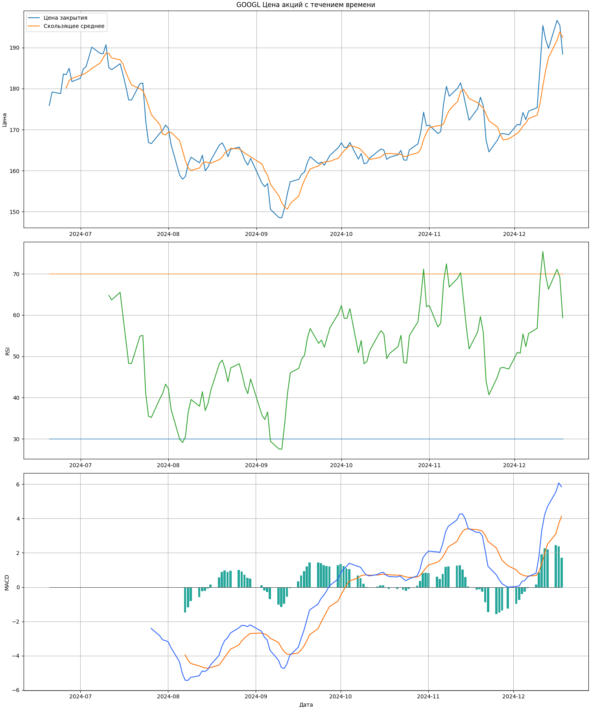

# Анализ и визуализация данных об акциях

Консольное приложение, которое
1. загружает из Интернета исторические данные об акциях для указанного тикера и временного периода,
2. рассчитывает скользящее среднее для цен закрытия,
3. рассчитывает индикатор RSI,
4. рассчитывает индикатор MACD,
5. строит графики и сохраняет их в PNG-файл,
6. вычисляет и выводит в консоль среднюю цену закрытия акций за указанный период,
7. уведомляет пользователя (в консоли), если цена акций колебалась более чем на заданный процент за период,
8. сохраняет данные в CSV.

## ⚙ Зависимости

Разработка и тестирование производились на стеке:


Установка библиотек:
```bash
pip install yfinance pandas matplotlib
```

## 🖥 Использование

1. Запуск приложения производится командой
    ```bash
    python main.py
    ```
2. После приветствия и краткого описания приложение попросит ввести тикер.
    ```text
    Добро пожаловать в инструмент получения и построения графиков биржевых данных.
    Вот несколько примеров биржевых тикеров, которые вы можете рассмотреть: AAPL (Apple Inc), GOOGL (Alphabet Inc), MSFT (Microsoft Corporation), AMZN (Amazon.com Inc), TSLA (Tesla Inc).
    Общие периоды времени для данных о запасах включают: 1д, 5д, 1мес, 3мес, 6мес, 1г, 2г, 5л, 10л, с начала года, макс.
    Введите тикер акции (например, «AAPL» для Apple Inc): 
    ```
3. После ввода тикера, приложение попросит ввести период для данных.
    ```text
    Введите период для данных (например, '1mo' для одного месяца): 
    ```
4. Загружаются данные из Интернета.
5. Рассчитывается скользящее среднее.
6. Приложение спрашивает, добавлять ли индикатор RSI.
    ```text
    Добавить индикатор RSI? y/N 
    ```
    Для добавления индикатора RSI требуется ввести `y` (или `Y`). Иначе — `N`.
    При вводе других символов будет выведено сообщение об ошибке, а ввод потребуется повторить.
    ```text
    Ошибка ввода!
    Добавить индикатор RSI? y/N 
    ```
7. Если на шаге `6` пользователь согласился добавить индикатор RSI, то индикатор рассчитывается.
8. Приложение спрашивает, добавлять ли индикатор MACD.
    ```text
    Добавить индикатор MACD? y/N 
    ```
    Для добавления индикатора MACD требуется ввести `y` (или `Y`). Иначе — `N`.
    При вводе других символов будет выведено сообщение об ошибке, а ввод потребуется повторить.
    ```text
    Ошибка ввода!
    Добавить индикатор MACD? y/N 
    ```
9. Если на шаге `8` пользователь согласился добавить индикатор MACD, то индикатор рассчитывается.
10. Приложение просит ввести имя файла (путь) для сохранения графиков. Если устраивает имя по умолчанию,
то можно ввести пустую строку.
    ```text
    Для сохранения графиков введите имя PNG-файла (путь) без расширения (по умолчанию — {ticker}_{period}_stock_price_chart.png): 
    ```
    Здесь `{ticker}` — тикер, введённый на шаге `2`; а `{period}` — период, введённый на шаге `3`.
11. Строятся графики цены закрытия, скользящего среднего и выбранных индикаторов.
12. Графики сохраняются в PNG-файл.
13. В консоль выводится сообщение о сохранении графиков.
14. В консоль выводится средняя цена закрытия акций за заданный период.
15. Приложение просит указать порог колебаний в процентах.
    ```text
    Укажите порог колебаний в процентах: 
    ```
    Если пользователь ошибся во вводе, приложение вернётся к вводу, объявив об ошибке.
    ```text
    Ошибка! Требуется указать число. Для отделения целой части от дробной используйте точку.
    Укажите порог колебаний в процентах: 
    ```
16. Уведомление пользователя, если цена акций колебалась более чем на заданный процент за период.
17. Для сохранения данных приложение просит ввести имя CSV-файла (путь) без расширения. Если введена пустая строка,
то используется значение по умолчанию — `stock`.
    ```text
    Для сохранения данных введите имя CSV-файла (путь) без расширения (по умолчанию — stock): 
    ```
18. Данные сохранятся в указанный файл, либо в `stock.csv`.
19. Выводится уведомление о сохранении (экспорте) данных с указанием имени файла, либо сообщение об ошибке.

## Пример графика


